# 解析

## 1：观察请求包
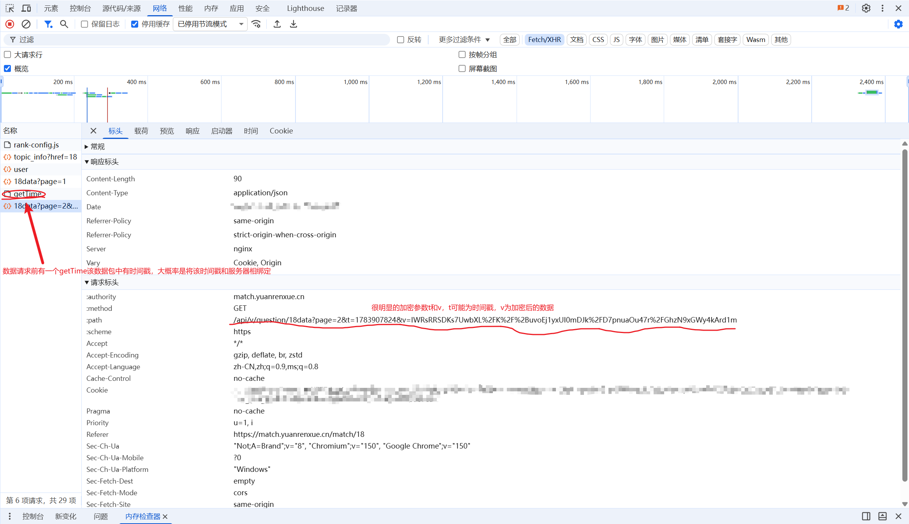
## 2：在操作台中用简单的window.t和window.v观察是否将参数暴露给了全局结果失败并没有暴给全局，查看源码寻找线
## 3：非jsvmp部分解析
### 可能是重写了某处的函数导致请求链中有大量的其他函数调用
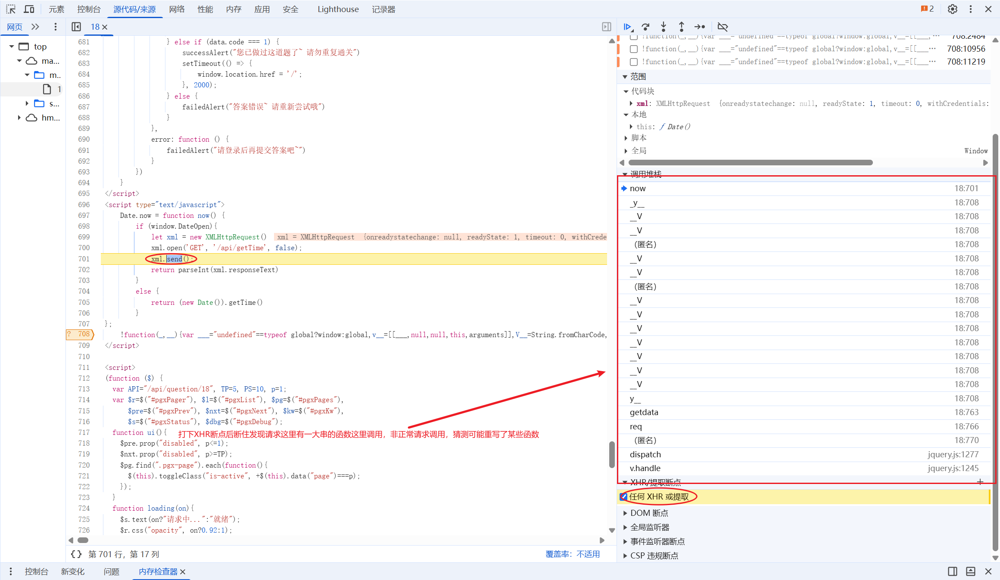
### 可以明显看到这里是重写了getdata中的open调用
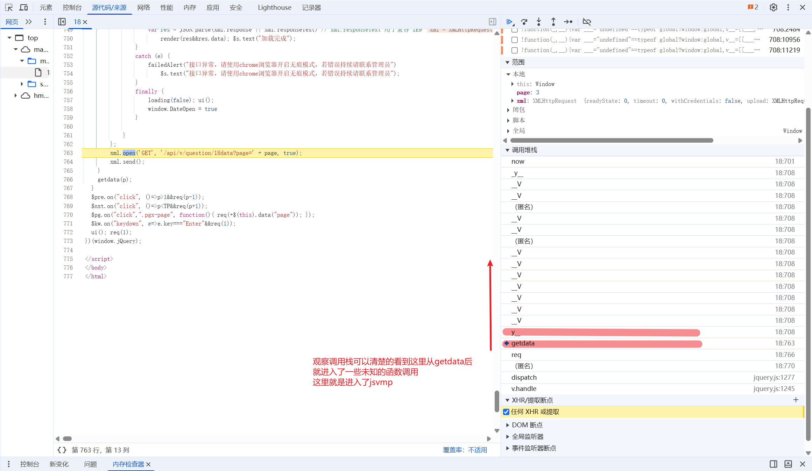
### xml.open具体可以参考 [XMLHttpRequest 规范](https://developer.mozilla.org/zh-CN/docs/Web/API/XMLHttpRequest/open) 的说明。
### 追入调用可以比较明显的看出是一个jsvmp这里并且可以定位解释器
## 3.5 知识补充
### 本题需要补充jsvmp的知识
#### Q.1：jsvmp是什么？
#### A.1: jsvmp是一个由js语言编写的，自定义的编译器，会编译特定的字节码，是一个黑箱。通常传入一段字节码，执行特定操作一个input一个output。
#### Q.2：通常jsvmp的有哪些特征？
#### A.2：解释器特征外侧有循环内测有大量的判断执行不同的字节码逻辑，vm会传入一串长不可读字符，运行时可能会有操作数数组，当前操作数指针，调用栈存放调用的函数调用位置，局部变量表存储当前函数运行的this等变量的信息。
#### Q.3：jsvmp一般分为哪几种解法？
#### A.3：1:去对关键函数关键位置插桩分析，包括字符拼接、apply、call函数调用位置，并对调用栈进行分析。2:分析Q.2提到的关键特征包括当前操作数、字节码、字节码栈、当前操作数指针…………（工程量超级大在有环境检测的情况下更难解）
#### Q.4：最好有哪些知识的时候去对抗jsvmp？
#### A.4：js代码基础得过关，对抽象语法树ast有一定的了解可以编写解混淆的脚本，对于OP等常见混淆有了解，对编译器有一定的了解（推荐去看[craftinginterpreters](https://craftinginterpreters.com/introduction.html)）,有超的耐心。
## 4 JSVMP分析
#### 接下来我们将正式进入jsvmp解析
##### 1：我们先在格式化jsvmp代码并且找到apply或者call的调用位置，通常jsvmp会用这两个函数去驱动函数调用，我们要找的是在jsvmp内部函数调用的apply如图
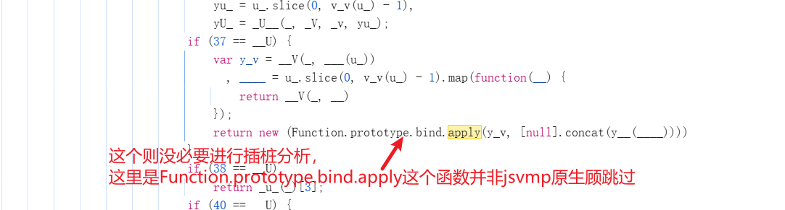
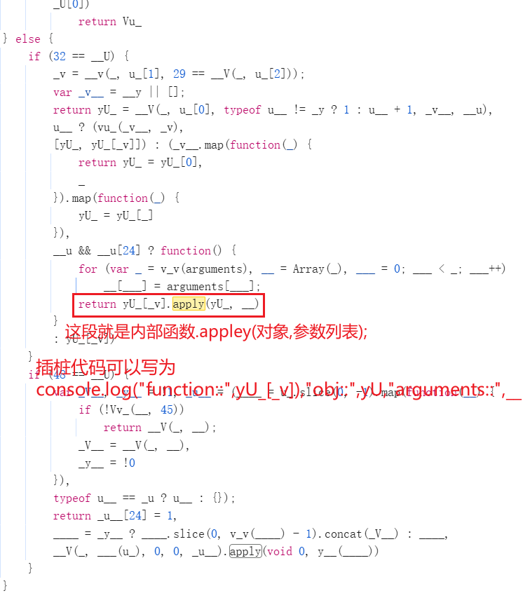
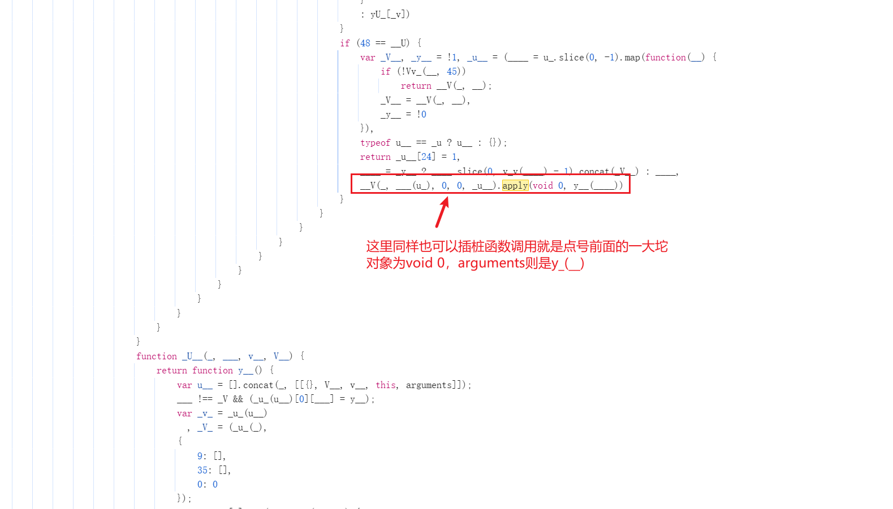
##### 上数图片为插桩点附上我的插桩代码(插桩代码不固定根据自己所好)
```
console.log("function::",yU_[_v],"object::",yU_,"arguments::",__);
console.log("function::",__V(_, ___(u_), 0, 0, _u__),"arguments::",y__(____));
```
##### 第一个插桩点效果这里图中提到y_为解释器是笔误这里观察到的是这里V_为解释器而y_为解释器入口
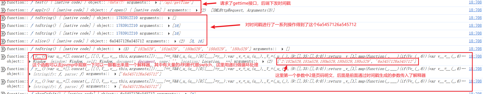
##### 有点CryptoJS使用的痕迹
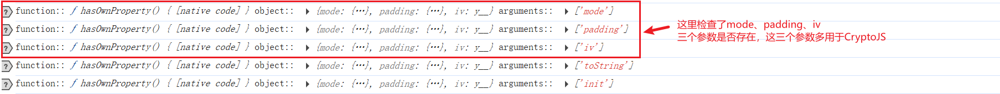
##### 对CryptoJS使用的分析
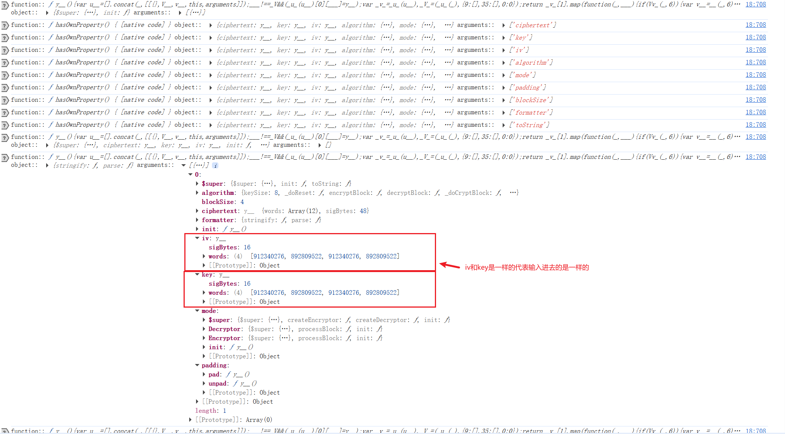
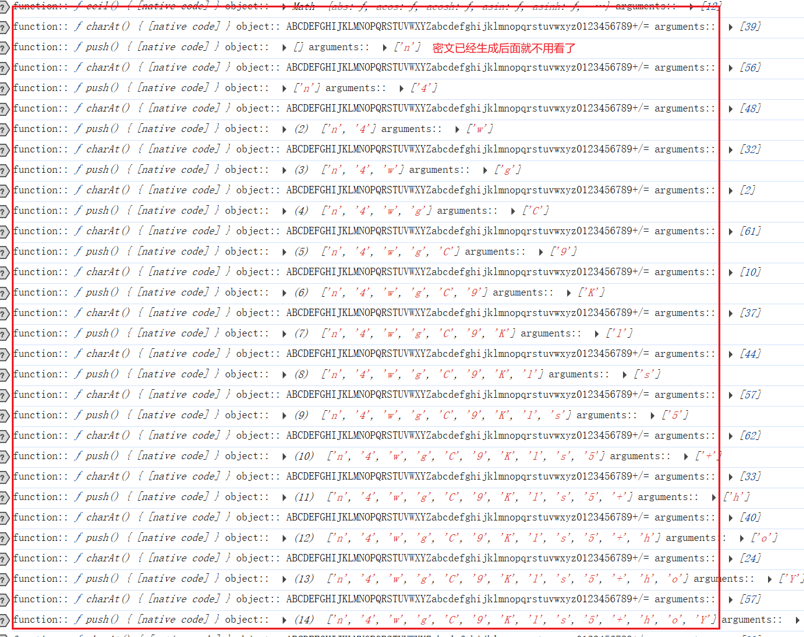
##### 第二个apply插桩点看到的和第一个信息基本一致这里不展示
##### apply处分析完毕进行后续分析，全文找字符串拼接
##### 可以全局查找常见的字符换拼接函数，这里知道必定有密文拼接的操作直接在此地插桩即可，fromCharCode、concat、join等
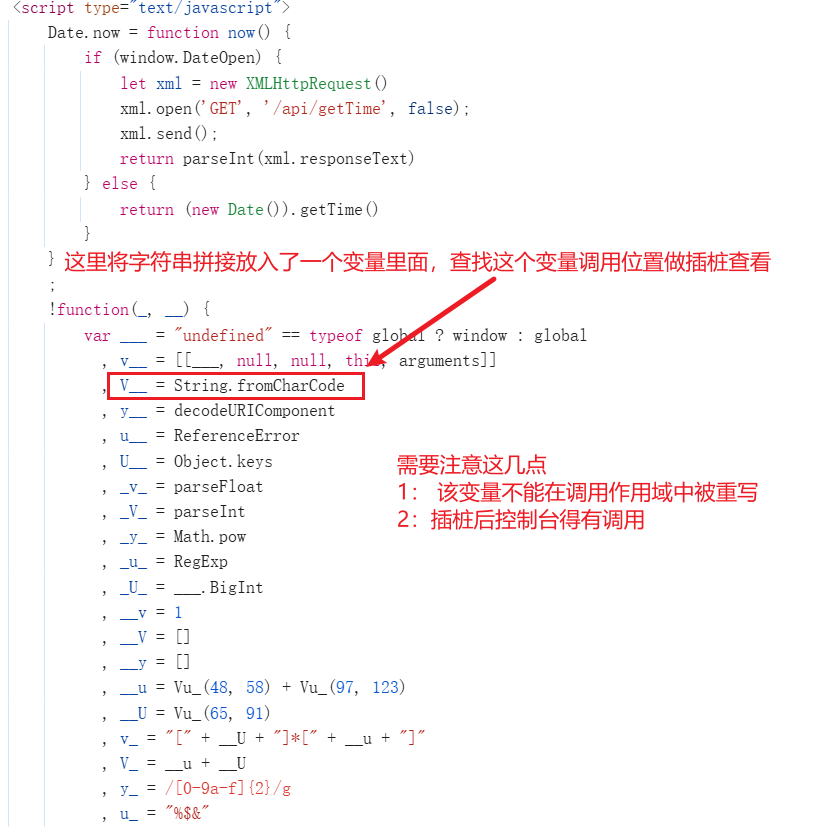
##### 找到这几个地方
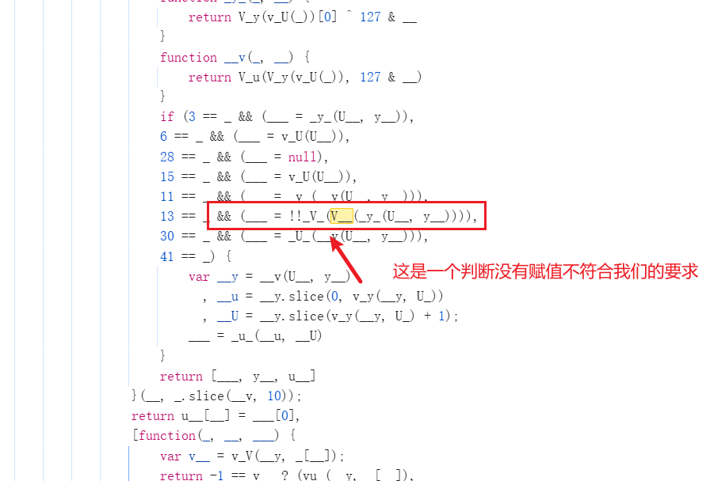
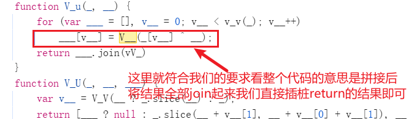

##### 还有很多地方但是很多作用域下重写了这里不一一展示
##### 附上两个插桩的代码
```
console.log(___);
console.log(___.join(vV_));
```
##### 第一个插桩位置没有数据顾直接跳过
##### 第二个插桩位置
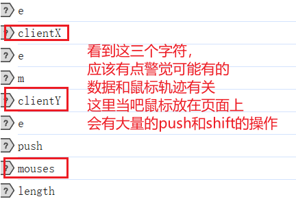
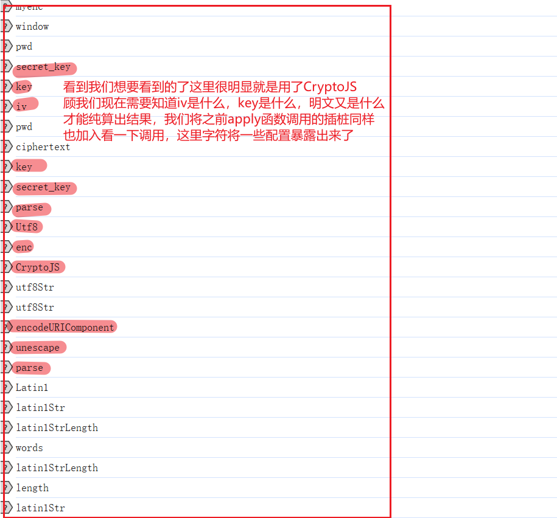
##### 加入apply的插桩前我们得了解CryptoJS
```
    var key = CryptoJS.enc.Utf8.parse(密钥);
    var iv  = CryptoJS.enc.Utf8.parse(iv);

    var 密文 = CryptoJS.AES.encrypt(plaintext, 密钥, {
        // 配置
        iv: iv,
        mode: CryptoJS.mode.CBC,
        padding: CryptoJS.pad.Pkcs7
    });
```
##### 从字符串拼接插桩我们可以看到这里算法用的是AES，所以我门现在需要得到原文，密钥，和配置
##### 我们接下来，加入apply的插桩查看源码来找出对应的参数值
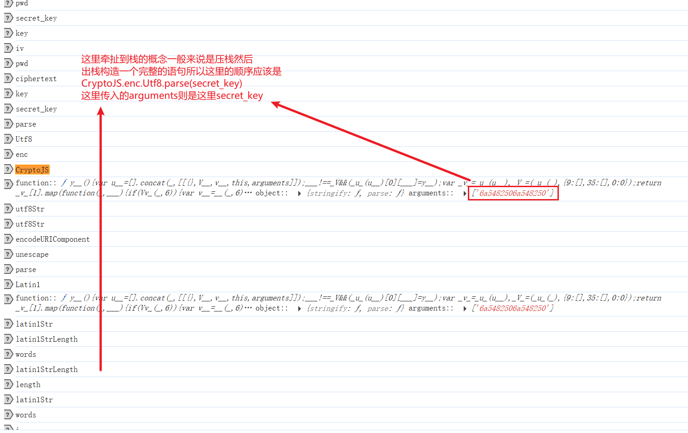
##### 这里我们可以看到这里已经找到一个参数了key的生成，前面有提到这里iv和key极大可能是相同的因为经过CryptoJS.enc.Utf8.parse两个生成的密文相同所以大概率这里传入的密文一致，我们还是从插桩来分析iv的值
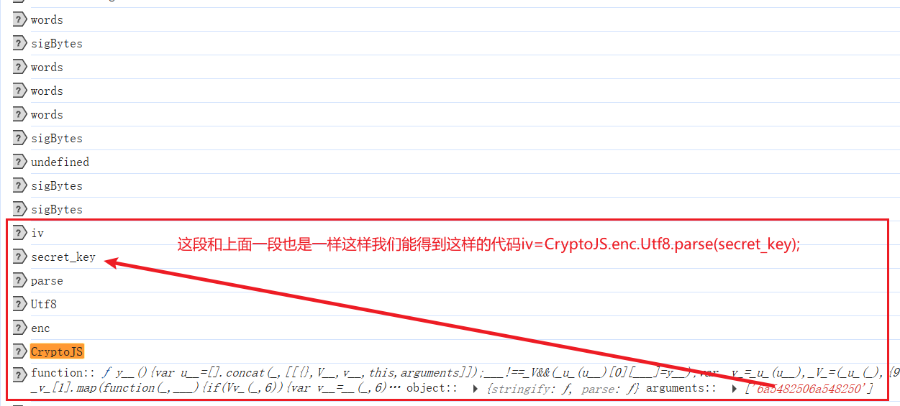
##### \o/\o/\o/这里我们惊奇的发现这两个parse的参数是一样的都是secret_key
##### 接下来我们看一下key加密入的参数是什么
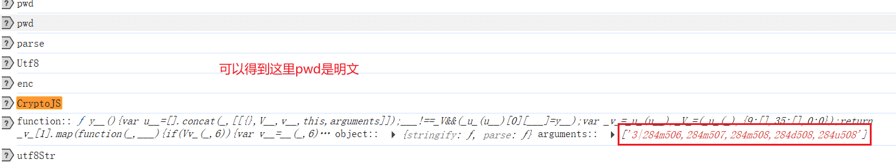
##### 我们总结一下现在得到的信息
```
1：key=iv=(时间戳.toString(16)+时间戳.toString(16)).slice(0,16);
2：pwd="3|284m506,284m507,284m508,284d508,284u508"
```
##### 这里pwd如果敏感的可以得出是鼠标轨迹这里也可以通过插桩得到
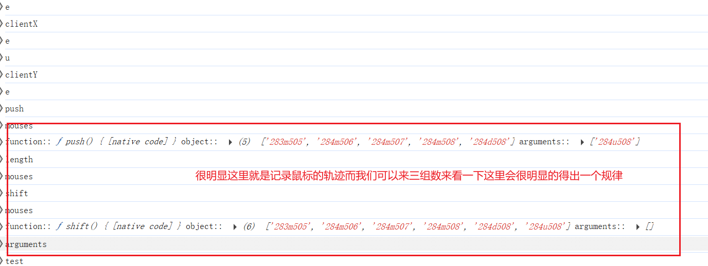
##### 可以得到后三个m、d、u一致然后前两个参数随机相差1-10顾可以写出一个模拟函数
```
def mouse(page):
    """生成鼠标轨迹明文"""
    basic_value_x = 300
    basic_value_y = 650 + random.randint(1, 100)
    result_x = [basic_value_x + random.randint(1, 150)]
    for _ in range(3):
        pd = random.randint(1, 10)
        add_value = random.randint(1, 15)
        if (pd % 2 or result_x[_] - add_value < 300):
            value = result_x[_] + add_value
        else:
            value = result_x[_] - add_value
        result_x.append(value)
    result = []
    for _ in result_x:
        result_item = str(_) + "m" + str(basic_value_y)
        result.append(result_item)
    d_value = result[-1].replace("m", "d")
    u_value = result[-1].replace("m", "u")
    result.append(d_value)
    result.append(u_value)
    result = ",".join(result)
    return str(page) + "|" + result
```
##### 之后就可以编写纯算代码具体代码看纯算.py，jsvmp.js
