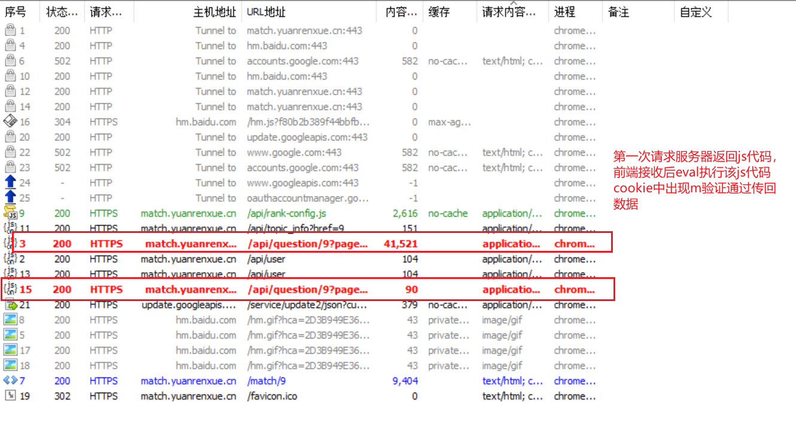
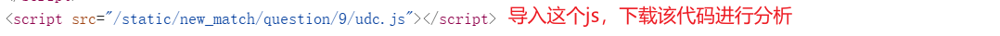
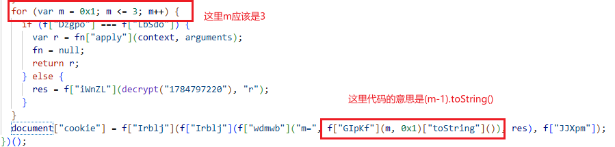
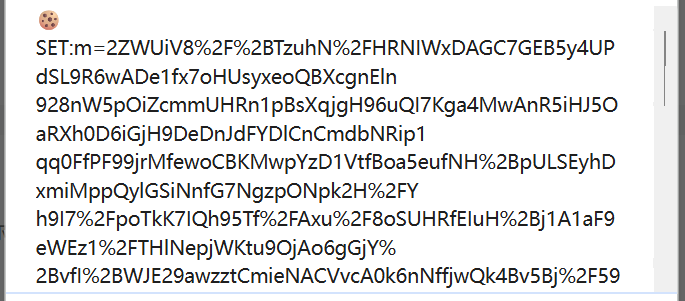
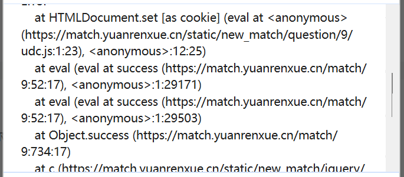
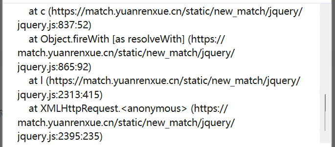
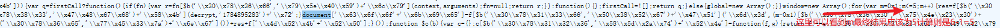
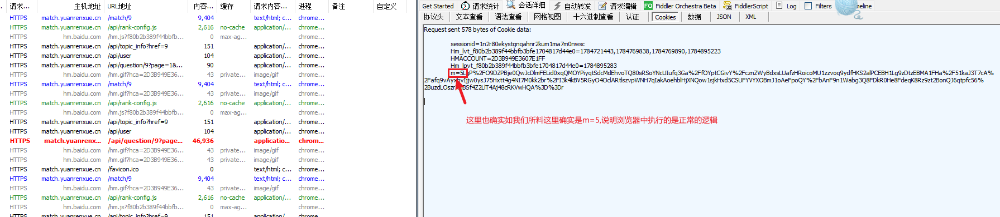
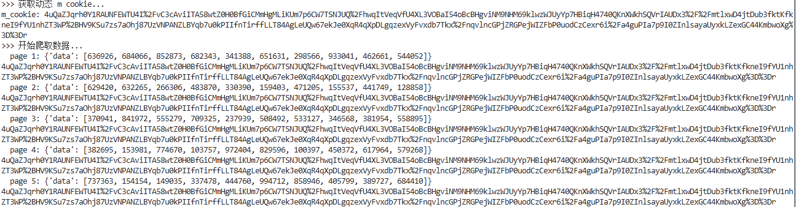

# 猿人学靶场 — JS 混淆动态 Cookie 2 逆向解析

## 前言

该题目涉及动态下发 JavaScript 代码、多层反调试、OB 混淆、RSA 加密以及浏览器与 Node 环境的差异化问题。本文档记录了完整的逆向分析与补环境过程。

---

## 整体流程

```
网页加载 → 执行网页 JS → 第一次发包获取服务端 JS → 执行服务端 JS 生成 m 参数 → 第二次发包携带 Cookie 获取数据
```

服务器下发的代码是**动态的**，每次请求返回的 JS 都不同，需通过 AST 脚本统一处理。

> 由于网页控制台存在大量无限 debugger、内存爆破和栈爆破，浏览器端直接调试极易卡死，建议通过抓包软件获取数据包进行分析。




---

## 反调试手段与处理方案

服务端 JS 中包含多种反调试技术，经调试发现以下几类触发点：

| # | 问题 | 错误信息 | 处理方式 |
|---|------|----------|----------|
| 1 | `window` 未定义 | `ReferenceError: window is not defined` | 将 `window` 替换为 `global` |
| 2 | 定时器干扰 | — | 删除定时器相关代码 |
| 3 | 递归栈爆破 | `RangeError: Maximum call stack size exceeded` | 定位调用位置，注释递归触发点 |
| 4 | 无限 debugger | — | 沿调用栈找到触发点并注释 |
| 5 | `console.log` 被重写 | 控制台无输出 | 外部 hook 自己的 console.log，不依赖代码内部的 console |

### 详细说明

#### 1. 无限 debugger

```javascript
if (_0x41a2bf["LRGDx"](
    ("" + _0x457d14 / _0x457d14)[_0x41a2bf["PfThc"]], 0x1
  ) || _0x41a2bf["EcSQr"](
    _0x41a2bf["kZLvt"](_0x457d14, 0x14), 0x0
  )) {
  debugger;
} else {
  debugger;
}
```

通过调用栈定位到上述代码段，将对应的 `debugger` 语句注释即可。

#### 2. 递归栈爆破

```javascript
var h = f["uZodW"](g, this, function () {
  var n = {};
  n["Apglg"] = "^([^ ]+( +[^ ]+)+)+[^ ]}";
  var o = n;
  var p = function () {
    var q = p["constructor"]("return /\" + this + \"/")()["compile"](o["Apglg"]);
    return !q["test"](h);
  };
  return f["mZEdX"](p);
});
f["wUpJK"](h);  // ← 注释掉这行自调用
```

#### 3. console 被重写

代码内部将所有 console 方法（`log`、`warn`、`debug`、`info`、`error`、`exception`、`trace`）替换为空函数。不修改代码内部逻辑，直接在外层 hook 自己的 console.log 来解决。

```javascript
if (!_0xe77b28["console"]) {
  _0xe77b28["console"] = function (_0x4e9bf3) { /* 将console各方法置为空函数 */ }(function(){});
} else {
  _0xe77b28["console"]["log"] = function(){};
  _0xe77b28["console"]["warn"] = function(){};
  // ... 其他方法同理
}
```

---

## 环境补充

### window / global 处理

搜索 `window` 关键字，定位到环境检测代码：

```javascript
if (window["crypto"] && window["crypto"]["getRandomValues"]) {
  // 正常逻辑
} else {
  global = new Array();
  window = new Array();
}
```

`window.crypto.getRandomValues` 在 Node 环境下不存在，补充一个空函数：

```javascript
window.crypto = {
  getRandomValues() {}
};
```

### JSEncrypt（RSA 加密库）

代码将 `window["JSEncrypt"]` 重写为自定义实现 `_0x4b4d2c`：

```javascript
window["JSEncrypt"] = _0x4b4d2c;
_0x20544c["JSEncrypt"] = _0x4b4d2c;
_0x20544c["default"] = _0x4b4d2c;
Object["defineProperty"](_0x20544c, _0x26b7fb["uoJHu"], { /* ... */ });
```

不深入分析其实现细节，保留原逻辑即可。

### decrypt 加密函数

```javascript
function _0x4f6d79(_0x50f9fa) {
  var _0x4e9298 = {
    "rolMp": "MIIBIjANBgkqhkiG9w0BAQEFAAOCAQ8AMIIBCgKCAQEA5GVku07yXCndaMS1evPIPyWwhbdWMVRqL4qg4OsKbzyTGmV4YkG8H0hwwrFLuPhqC5tL136aaizuL/lN5DRRbePct6syILOLLCBJ5J5rQyGr00l1zQvdNKYp4tT5EFlqw8tlPkibcsd5Ecc8sTYa77HxNeIa6DRuObC5H9t85ALJyDVZC3Y4ES/u61Q7LDnB3kG9MnXJsJiQxm1pLkE7Zfxy29d5JaXbbfwhCDSjE4+dUQoq2MVIt2qVjZSo5Hd/bAFGU1Lmc7GkFeLiLjNTOfECF52ms/dks92Wx/glfRuK4h/fcxtGB4Q2VXu5k68e/2uojs6jnFsMKVe+FVUDkQIDAQAB"
  };
  const _0x506402 = _0x4e9298["rolMp"];
  const _0xc7daa3 = new JSEncrypt();
  _0xc7daa3["setPublicKey"](_0x506402);
  return encodeURIComponent(_0xc7daa3["encrypt"](_0x50f9fa));
}
window["decrypt"] = _0x4f6d79;
```

这是一个使用 RSA 公钥加密的函数，内部使用自定义的 `JSEncrypt` 库。

### Navigator 环境补充

搜索 `Navigator` 发现三处检测，需要补充对应的 navigator 属性：

```javascript
// 检测 navigator.appName
_0x26b7fb["aMjiq"](_0x26b7fb["CsnKg"], navigator["appName"]);
_0x26b7fb["mbIUD"] != navigator["appName"];

// 检测 navigator.uA
/MSIE/["test"](navigator["uA"]) && (_0xcfffe5 = function (...) { /* ... */ });
```

### 其他注意

- 搜索 `window` 关键词时，注意 `window = new Array()` 这种赋值，这是环境检测不通过时的降级处理
- 可能还有其他环境检测点，建议搜索常见关键词：`window`、`Navigator`、`global` 等

---

## 核心难点：m 参数 -1 问题

这是本题最关键的坑点。

### 现象

核心 Cookie 生成代码中 `m` 被 `-1`：



```javascript
m = result - 1;
```

然而在**浏览器环境下，这个 -1 不应该被执行**。如果不做处理直接运行补环境代码，会得到错误的 m 参数，服务器返回的是混淆代码而非正常数据。

### 可能的猜测

1. **document.cookie 的 hook 拦截？**  
   对整个流程中 document.cookie 的 get 和 set 进行 hook，发现整个流程只有**一次触发**，且调用栈无异常（console.log 被代码 hook，改用 alert 查看调用栈）：
   - 
   - 
   - 

2. **-1 被其他逻辑 hook？** 未发现相关逻辑。

3. **环境差异：浏览器 vs Node**  
   通过抓包对比发现，浏览器发送的 Cookie 前缀中**没有 -1**，而补环境 Node 未经处理时 m 比浏览器少了一个字符，导致前缀+密文拼接后始终错误：

   
   

**结论：这是浏览器环境和 Node 环境的差异造成的。浏览器中是原文（不减1），Node 补环境时需要将 -1 去掉（即 result 不 -1）。**

检查了所有可能的修改点（定时器、加密函数、其他逻辑），确认加密函数在浏览器和 Node 中生成的加密参数一致，问题就出在前缀 + 加密参数的拼接环节。

成功请求的效果：



---

## 解题方案选择

### 方案一：纯算（不补环境）

进一步分析代码，提取服务端传入 `decrypt` 的参数，在网页端的解密函数中直接解密得出 m 参数。

> 参考：[纯算解析](https://www.cnblogs.com/NolaLi/p/19989307)

### 方案二：补环境（本文采用）

1. **解混淆**（可选）—— 参考 `解混淆_网页.js`
2. **清理反调试代码** —— 参考 `解混淆_网页.js` 和 `解密函数_网页.js`，得到 `net_page_clean_js_code.js`
3. **补充环境 + 拼接代码**
   - 先注入浏览器端代码
   - 再注入服务端代码
   - 上下文统一后生成 Cookie
   - 参考 `前插代码.js` 和 `后插代码.js`

> **注意**：AST 处理后的代码中，解密函数和搭配的自执行函数不会被自动删除。如果保留，需要手动消除其中的反调试代码，否则运行时会触发反调试。

---

## 附：AST 处理说明

OB 混淆部分的还原（详情参考 `解混淆_网页.js` 和 `解密函数_网页.js`）：

- 使用 AST 脚本解 OB 混淆，得到初步清洗后的代码 `net_page_clean_js_code.js`
- 脚本不会自动删除解密函数和自执行的反调试代码，需要手动处理
- 反调试代码的主要排查方向：定时器、递归自调用、无限 debugger、console 重写

---

## 文件说明

| 文件 | 说明 |
|------|------|
| `解混淆_网页.js` | AST 解混淆脚本 |
| `解密函数_网页.js` | 解密函数处理脚本 |
| `net_page_clean_js_code.js` | 解混淆后的网页端代码 |
| `前插代码.js` | 补环境：前置注入（环境、全局变量） |
| `后插代码.js` | 补环境：后置导出（Cookie 生成结果） |
| `解析.md` | 本文档 |
