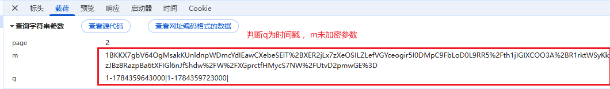
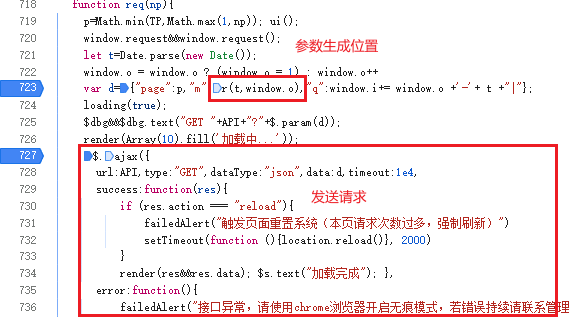

## 解析
### 1：看请求很清楚看到有q和m两个参数，q很明显是一个时间戳，看到后面2-3-4-5有连续的时间戳记录

### 2：找到请求代码

### 3：追到r函数位置
#### 具体代码看混淆源码.js
### 4：这里利用插桩可以解决AAencoding的混淆得到源码是
```
ﾟωﾟﾉ= undefined;
o= 1;
c= 0;
(ﾟoﾟ)= "constructor";
(ﾟεﾟ)= "return";
(ﾟｰﾟ)= 4;
(ﾟΘﾟ)=1;
(oﾟｰﾟo)= "u";
(ﾟДﾟ)={
    1:"f",
    "c":"c",
    "constructor":"\"",
    "o":"o",
    "return":"\\",
    "ﾟΘﾟ":"_",
    "ﾟΘﾟﾉ":"b",
    "ﾟωﾟﾉ":"a",
    "ﾟДﾟﾉ":"e",
    "ﾟｰﾟﾉ":"d",
    "_":Function
}
```
### 在node下会出现window未定义的问题补全window环境，其中有一段代码
```
window = {};
```
### 在浏览器环境中无法将window置为{}但是在node下可以这么操作所以是一中node识别将其改为window=global 
### 这段同样也是环境检测
```
var we, ke, xe = [][(![] + [])[!+[] + !![] + !![]] + ([] + {})[+!![]] + (!![] + [])[+!![]] + (!![] + [])[+[]]][([] + {})[!+[] + !![] + !![] + !![] + !![]] + ([] + {})[+!![]] + ([][[]] + [])[+!![]] + (![] + [])[!+[] + !![] + !![]] + (!![] + [])[+[]] + (!![] + [])[+!![]] + ([][[]] + [])[+[]] + ([] + {})[!+[] + !![] + !![] + !![] + !![]] + (!![] + [])[+[]] + ([] + {})[+!![]] + (!![] + [])[+!![]]]((+!![] + []) + (!+[] + !![] + !![] + !![] + !![] + []) + (!+[] + !![] + !![] + !![] + !![] + !![] + !![] + []) + (+!![] + []) + (!+[] + !![] + !![] + !![] + !![] + []) + (+[] + []) + (!+[] + !![] + !![] + !![] + !![] + !![] + !![] + []) + (+[] + []))(!+[] + !![] + !![] + !![] + !![] + !![] + !![]) == ([][(![] + [])[!+[] + !![] + !![]] + ([] + {})[+!![]] + (!![] + [])[+!![]] + (!![] + [])[+[]]][([] + {})[!+[] + !![] + !![] + !![] + !![]] + ([] + {})[+!![]] + ([][[]] + [])[+!![]] + (![] + [])[!+[] + !![] + !![]] + (!![] + [])[+[]] + (!![] + [])[+!![]] + ([][[]] + [])[+[]] + ([] + {})[!+[] + !![] + !![] + !![] + !![]] + (!![] + [])[+[]] + ([] + {})[+!![]] + (!![] + [])[+!![]]]((+!![] + []) + (!+[] + !![] + !![] + !![] + !![] + !![] + []) + (!+[] + !![] + !![] + !![] + !![] + !![] + !![] + []) + (!+[] + !![] + !![] + !![] + !![] + !![] + !![] + []) + (!+[] + !![] + !![] + !![] + !![] + !![] + !![] + []) + (!+[] + !![] + []) + (+!![] + []) + (!+[] + !![] + !![] + !![] + !![] + []))(!+[] + !![] + !![] + !![] + !![] + !![]) & [][(![] + [])[!+[] + !![] + !![]] + ([] + {})[+!![]] + (!![] + [])[+!![]] + (!![] + [])[+[]]][([] + {})[!+[] + !![] + !![] + !![] + !![]] + ([] + {})[+!![]] + ([][[]] + [])[+!![]] + (![] + [])[!+[] + !![] + !![]] + (!![] + [])[+[]] + (!![] + [])[+!![]] + ([][[]] + [])[+[]] + ([] + {})[!+[] + !![] + !![] + !![] + !![]] + (!![] + [])[+[]] + ([] + {})[+!![]] + (!![] + [])[+!![]]]((+[] + []) + [][(![] + [])[!+[] + !![] + !![]] + ([] + {})[+!![]] + (!![] + [])[+!![]] + (!![] + [])[+[]]][([] + {})[!+[] + !![] + !![] + !![] + !![]] + ([] + {})[+!![]] + ([][[]] + [])[+!![]] + (![] + [])[!+[] + !![] + !![]] + (!![] + [])[+[]] + (!![] + [])[+!![]] + ([][[]] + [])[+[]] + ([] + {})[!+[] + !![] + !![] + !![] + !![]] + (!![] + [])[+[]] + ([] + {})[+!![]] + (!![] + [])[+!![]]]((!![] + [])[+!![]] + ([][[]] + [])[!+[] + !![] + !![]] + (!![] + [])[+[]] + ([][[]] + [])[+[]] + (!![] + [])[+!![]] + ([][[]] + [])[+!![]] + ([] + {})[!+[] + !![] + !![] + !![] + !![] + !![] + !![]] + ([][[]] + [])[+[]] + ([][[]] + [])[+!![]] + ([][[]] + [])[!+[] + !![] + !![]] + (![] + [])[!+[] + !![] + !![]] + ([] + {})[!+[] + !![] + !![] + !![] + !![]] + (+{} + [])[+!![]] + ([] + [][(![] + [])[!+[] + !![] + !![]] + ([] + {})[+!![]] + (!![] + [])[+!![]] + (!![] + [])[+[]]][([] + {})[!+[] + !![] + !![] + !![] + !![]] + ([] + {})[+!![]] + ([][[]] + [])[+!![]] + (![] + [])[!+[] + !![] + !![]] + (!![] + [])[+[]] + (!![] + [])[+!![]] + ([][[]] + [])[+[]] + ([] + {})[!+[] + !![] + !![] + !![] + !![]] + (!![] + [])[+[]] + ([] + {})[+!![]] + (!![] + [])[+!![]]]((!![] + [])[+!![]] + ([][[]] + [])[!+[] + !![] + !![]] + (!![] + [])[+[]] + ([][[]] + [])[+[]] + (!![] + [])[+!![]] + ([][[]] + [])[+!![]] + ([] + {})[!+[] + !![] + !![] + !![] + !![] + !![] + !![]] + (![] + [])[!+[] + !![]] + ([] + {})[+!![]] + ([] + {})[!+[] + !![] + !![] + !![] + !![]] + (+{} + [])[+!![]] + (!![] + [])[+[]] + ([][[]] + [])[!+[] + !![] + !![] + !![] + !![]] + ([] + {})[+!![]] + ([][[]] + [])[+!![]])(+!![]))[!+[] + !![] + !![]] + ([][[]] + [])[!+[] + !![] + !![]])(!+[] + !![] + !![] + !![] + !![])([][(![] + [])[!+[] + !![] + !![]] + ([] + {})[+!![]] + (!![] + [])[+!![]] + (!![] + [])[+[]]][([] + {})[!+[] + !![] + !![] + !![] + !![]] + ([] + {})[+!![]] + ([][[]] + [])[+!![]] + (![] + [])[!+[] + !![] + !![]] + (!![] + [])[+[]] + (!![] + [])[+!![]] + ([][[]] + [])[+[]] + ([] + {})[!+[] + !![] + !![] + !![] + !![]] + (!![] + [])[+[]] + ([] + {})[+!![]] + (!![] + [])[+!![]]]((!![] + [])[+!![]] + ([][[]] + [])[!+[] + !![] + !![]] + (!![] + [])[+[]] + ([][[]] + [])[+[]] + (!![] + [])[+!![]] + ([][[]] + [])[+!![]] + ([] + {})[!+[] + !![] + !![] + !![] + !![] + !![] + !![]] + ([][[]] + [])[!+[] + !![] + !![]] + (![] + [])[!+[] + !![] + !![]] + ([] + {})[!+[] + !![] + !![] + !![] + !![]] + (+{} + [])[+!![]] + ([] + [][(![] + [])[!+[] + !![] + !![]] + ([] + {})[+!![]] + (!![] + [])[+!![]] + (!![] + [])[+[]]][([] + {})[!+[] + !![] + !![] + !![] + !![]] + ([] + {})[+!![]] + ([][[]] + [])[+!![]] + (![] + [])[!+[] + !![] + !![]] + (!![] + [])[+[]] + (!![] + [])[+!![]] + ([][[]] + [])[+[]] + ([] + {})[!+[] + !![] + !![] + !![] + !![]] + (!![] + [])[+[]] + ([] + {})[+!![]] + (!![] + [])[+!![]]]((!![] + [])[+!![]] + ([][[]] + [])[!+[] + !![] + !![]] + (!![] + [])[+[]] + ([][[]] + [])[+[]] + (!![] + [])[+!![]] + ([][[]] + [])[+!![]] + ([] + {})[!+[] + !![] + !![] + !![] + !![] + !![] + !![]] + (![] + [])[!+[] + !![]] + ([] + {})[+!![]] + ([] + {})[!+[] + !![] + !![] + !![] + !![]] + (+{} + [])[+!![]] + (!![] + [])[+[]] + ([][[]] + [])[!+[] + !![] + !![] + !![] + !![]] + ([] + {})[+!![]] + ([][[]] + [])[+!![]])(+!![]))[!+[] + !![] + !![]] + ([][[]] + [])[!+[] + !![] + !![]])(!+[] + !![] + !![] + !![] + !![] + !![] + !![] + !![])(([] + {})[+[]])[+[]] + (!+[] + !![] + !![] + !![] + !![] + !![] + !![] + []) + (!+[] + !![] + !![] + !![] + !![] + !![] + !![] + !![] + [])) + ([][[]] + [])[!+[] + !![]] + ([][[]] + [])[!+[] + !![] + !![]] + (+{} + [])[+!![]] + ([][[]] + [])[!+[] + !![]] + ([] + {})[!+[] + !![]] + ([][[]] + [])[!+[] + !![] + !![]] + ([][[]] + [])[!+[] + !![] + !![]] + ([][[]] + [])[!+[] + !![] + !![] + !![]] + ([] + {})[!+[] + !![] + !![] + !![] + !![]] + (+{} + [])[+!![]] + ([][[]] + [])[!+[] + !![] + !![] + !![]] + ([][[]] + [])[!+[] + !![] + !![]])(!+[] + !![] + !![]));
                    xe && "Microsoft Internet Explorer" == navigator.appName ? (b.prototype.am = i,
                    we = 26) : xe && "Netscape" != navigator.appName ? (b.prototype.am = e,
                    we = 26) : (b.prototype.am = s,
                    we = 28),
```
### 直接注释即可插桩可以观察到var we, ke, xe基本无变化可以在后面固定值将这段同样注释处理
```
r = "Mozilla/5.0 (Windows NT 10.0; Win64; x64) AppleWebKit/537.36 (KHTML, like Gecko) Chrome/150.0.0.0 Safari/537.36",
o = window && window,
a = o && o.href;
```
### 这段建议硬编码源码意思为navigator得到相关指纹，建议补一个navigator指纹
```
navigator = {
    appCodeName: "Mozilla",
    appName: "Netscape",
    appVersion: "5.0 (Windows NT 10.0; Win64; x64) AppleWebKit/537.36 (KHTML, like Gecko) Chrome/150.0.0.0 Safari/537.36",
    platform: "Win32",
    product: "Gecko",
    productSub: "20030107",
    userAgent: "Mozilla/5.0 (Windows NT 10.0; Win64; x64) AppleWebKit/537.36 (KHTML, like Gecko) Chrome/150.0.0.0 Safari/537.36",
    vendor: "Google Inc.",
    vendorSub: "",
    language: "zh-CN",
    languages: ["zh-CN", "zh", "ms"],
    cookieEnabled: true,
    onLine: true,
    hardwareConcurrency: 16,
    maxTouchPoints: 10
};
```
### 最后传入外侧生成的时间戳即可
```
function get_value(ts){
    let re=r(ts,1);
    return JSON.stringify({
        "q":String(ts),
        "m":re
    })
}
```
### 这里r的parm2固定为1，parm1为时间戳
### 看到这里wow这道题目好简单其实并非这里有一个坑，不仔细看不会注意到
### 这里如果按照当前进度生成m后格式化请求会得到第一页数据其他页面数据会被风控拦住
### 这里一般说会出现这几种想法
#### 1：延迟请求每个数据包之间有固定或者特定的距离因为q参数有传入一串时间戳
#### 2：加速请求和第一个理由一致
#### 3：有诈，加密参数在第一次执行完毕后可能会改变
### 这些确实都存在但是全是烟雾弹
#### 1：经过测试这里再浏览器中快速单机下一页确实不会触发风控但是这里在node情况下还是没有解决风控问题
#### 2：加长请求的间隔还是会出现风控，浏览器同理
#### 3：分析是否有其他改变加密逻辑的情况，发现这样一段代码
```
var Be = function(t) {
    if (this.count = this.count || 0,
                        this.count >= 256 || Ee >= Me)
                            try {
                                var e = t.x + t.y;
                                Ae[Ee++] = 255 & e,
                                this.count += 1
                            } catch (y) {}
                    };
                    // 加入鼠标监听
                    window.addEventListener ? window.addEventListener("mousemove", Be, !1) : window.attachEvent && window.attachEvent("onmousemove", Be)
```
#### 这里添加了一个监听并且回调中可能存在改变AE的情况，但是还是很遗憾这里插桩会发现这里无法进入后续修改AE的逻辑这用为假
### 那么到底是什么问题导致了这里会出现这个情况呢
#### 问题出在var _n;该变量上
```
看这段代码这里s[t]为js加密包不用管
function n(t) {
        if (s[t])
            return s[t].exports;
        var e = s[t] = {
            i: t,
            l: !1,
            exports: {}
        };
        return i[t].call(e.exports, e, e.exports, n),
        e.l = !0,
        e.exports
    }
    // 将n函数缓存给了_n?
    _n = n;
```
#### 这里关键
```
var Re, Ae, Ee;       // ← 闭包变量，模块缓存一次就永久存活

    function ne() {
        if (null == Re) {        // 只初始化一次
            Re = se();
            // 用 Ae 填充 Re (RC4)
        }
        return Re.next();        // 每次调用推进 RC4 流
    }
```
### 这里Re，Ae，Ee都是window下的闭包也就是说这里不会被重置而是会被保存，所以这里浏览器中的操作应该是
### (浏览器环境)第一次执行初始化Re,Ae,Ee等参数->第二次请求复用上次window下的参数
### (node)每次调用get_value环境都会导致window被覆盖所以Re，Ae，Ee都是全新的恰好只是满足第一页的要求
### 这里逻辑一下就清楚了，这里的修改是将参数一次性产生避免每次调用js代码出现刷新window的情况
### 具体代码实现见解码、.js

